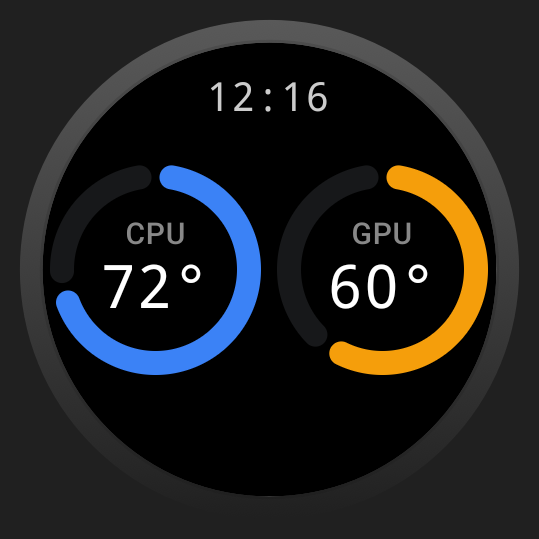

# Temp Watcher

*Personal project / actively developed.*

A Wear OS app for monitoring PC temperatures directly from a smartwatch.

The app connects to a small local API running on the PC and displays CPU and GPU temperatures on the
watch.

## Features

- Live CPU temperature
- Live GPU temperature
- Connection status and retry
- Configurable PC IP address and port
- Simple Wear OS interface
- Responsive UI for different watch sizes

## Requirements

- Wear OS smartwatch
- A PC running the [Temp Watcher API](https://github.com/Qualyyy/temp-watcher)
- Both devices connected to the same local network

## Installation

The Wear OS app is currently installed by building the project from source.

### Requirements

- [Android Studio](https://developer.android.com/studio)
- A Wear OS watch running Android 11 (API 30) or newer

### Steps

1. Clone this repository.
2. Open the project in Android Studio.
3. Connect your Wear OS watch to Android Studio.
4. Enable **Developer Options** and **ADB or Wireless debugging** on your watch.
5. Select the Wear OS `app` configuration in Android Studio.
6. Select your connected watch as the target device.
7. Click **Run** in Android Studio.

Android Studio will build and install the application directly on your watch.

### Configuration

After installing the app, scroll to **Settings** on the watch and enter:

- **IP Address** — The local IP address of the PC running Temp Watcher.
- **Port** — The port used by the Temp Watcher API.

The PC and watch must be connected to the same local network.

The Temp Watcher API displays the IP address and port it is running on when the Windows application
starts.

## Planned Features

- Local LAN control of Govee lights

## License

This project is licensed under the [MIT License](LICENSE).
